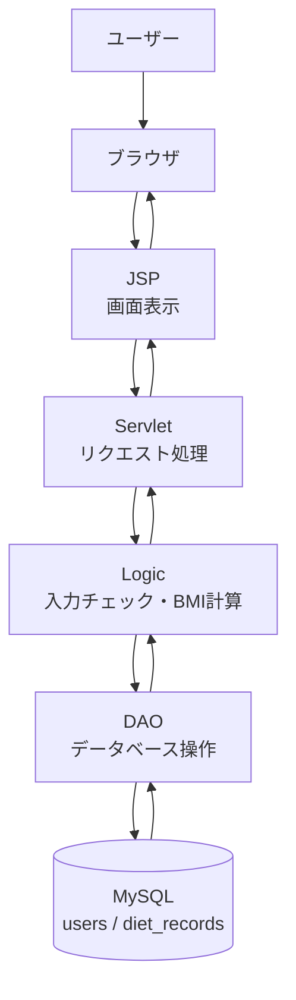
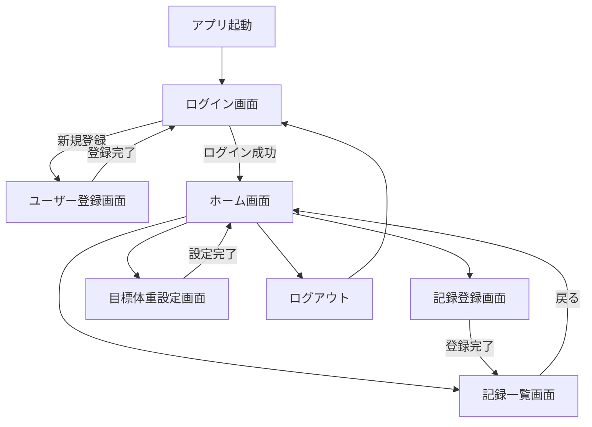

# Diet Manager（ダイエット管理アプリ）

## 概要

Diet Managerは、日々の体重・BMI・食事・運動内容を記録できるダイエット管理Webアプリです。

職業訓練で学習したJava、Servlet/JSP、MySQLを活用し、授業で制作した「どこつぶ」の構成を参考にして制作します。  
ユーザーごとにダイエット記録を管理し、日々の体重変化や目標体重との差を確認できるアプリを目指します。

## アーキテクチャ図

## 画面遷移図

## DB設計

### usersテーブル

| カラム名 | 型 | 内容 |
| --- | --- | --- |
| id | INT | ユーザーID |
| name | VARCHAR(50) | ユーザー名 |
| password | VARCHAR(255) | パスワード |
| created_at | DATETIME | 登録日時 |

### diet_recordsテーブル

| カラム名 | 型 | 内容 |
| --- | --- | --- |
| id | INT | 記録ID |
| user_id | INT | ユーザーID |
| record_date | DATE | 記録日 |
| weight | DECIMAL(5,2) | 体重 |
| bmi | DECIMAL(4,1) | BMI |
| breakfast | VARCHAR(255) | 朝食 |
| lunch | VARCHAR(255) | 昼食 |
| dinner | VARCHAR(255) | 夕食 |
| exercise | VARCHAR(255) | 運動内容 |
| memo | TEXT | メモ |
| created_at | DATETIME | 登録日時 |

## 機能

- ユーザー登録
- ログイン / ログアウト
- 体重登録
- 体重履歴表示
- BMI計算
- 目標体重管理
- 進捗確認
- ユーザーごとの記録管理
'''

## 使用技術

- Java
- Servlet / JSP
- MySQL
- JDBC
- HTML / CSS
- Eclipse
- Git / GitHub

## 工夫した点

- Servlet、JSP、Logic、DAOに役割を分け、処理の流れをわかりやすくします。
- 体重データをMySQLに保存し、履歴として確認できるようにします。
- ログイン中のユーザー情報を使い、自分の記録だけを表示できるようにします。
- BMI計算や目標体重との差分を表示し、進捗を確認しやすくします。

## 今後の改善

- 記録の編集機能
- グラフ表示機能の追加
- 入力チェックの強化
- 画面デザインの改善
