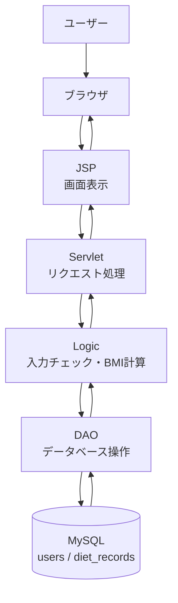
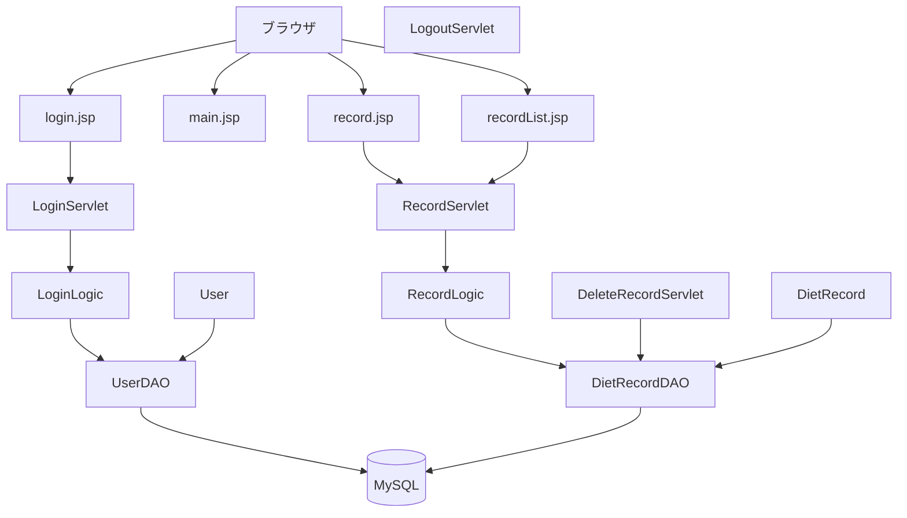

# Diet Manager（ダイエット管理アプリ）

## 概要
## アーキテクチャ図

Javaで作成した体重管理アプリです。
日々の体重とBMIを記録し、ダイエットの進捗を可視化することを目的としています。

## 機能

* 体重登録
* 体重履歴表示
* BMI計算
* 目標体重管理
* 進捗確認

## 使用技術

* Java
* Eclipse
* Git / GitHub

## 工夫した点

* クラスを分けて設計し、拡張しやすい構造にしました
* 体重データを履歴として管理できるようにしました

## 今後の改善

* データベース連携（MySQL）
* GUI化（Swing）
* グラフ表示機能の追加
